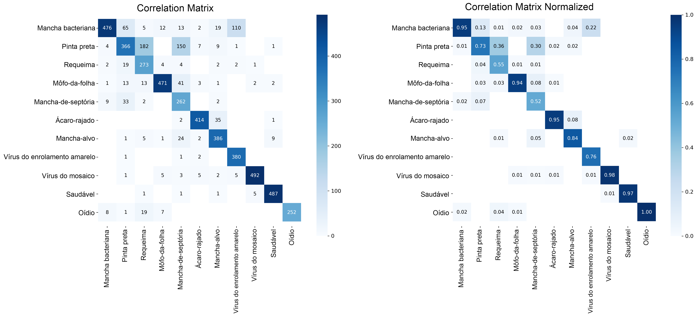

# 🍅 Diagnóstico de Doenças em Tomates com YOLOv8 & Streamlit

Este repositório contém uma aplicação interativa desenvolvida em **Streamlit** voltada para o diagnóstico automatizado de doenças em folhas de tomateiro através de visão computacional. O aplicativo funciona como uma prova de conceito e demonstração prática da abordagem proposta no artigo científico anexado: **"AI-Enabled Reconfigurable Edge Device for Plant Health Assessment in Greenhouse Environment"**.

O sistema utiliza um modelo de aprendizado profundo leve e otimizado (**YOLOv8 Nano Classifier**), treinado para operar de forma eficiente em ambientes de recursos computacionais restritos (Edge Computing / Dispositivos de Borda), alinhando-se à proposta de monitoramento inteligente e reconfigurável descrita no artigo.

---

## 📄 Contexto Científico e Vinculação com o Artigo

O artigo associado apresenta o desenvolvimento de um dispositivo de borda (*Edge Device*) reconfigurável e habilitado para IA, projetado para monitorar a saúde de plantas em estufas através de sensoriamento multimodal (sensores espectrais VIS/NIR, módulo térmico e câmera RGB).

Esta aplicação de software ilustra e valida a viabilidade dessa arquitetura ao demonstrar como modelos de Deep Learning altamente eficientes (como a variante de classificação do YOLOv8) podem realizar diagnósticos em nível de folha em tempo real com alta acurácia, permitindo:

1. **Detecção Precoce de Patógenos:** Minimizar a perda de safras e otimizar o uso de defensivos agrícolas.
2. **Capacidade de Reconfiguração:** Facilidade em atualizar ou substituir os pesos do modelo (`.pt`) para adaptar o sistema a diferentes culturas agrícolas ou mutações de patógenos, sem alterar a infraestrutura de código base.

---

## 🛠️ Pipeline de Geração do Modelo (`tomate_treina_modelo_yolo8n.ipynb`)

O modelo de classificação foi gerado utilizando o pipeline de treinamento contido no notebook Jupyter `tomate_treina_modelo_yolo8n.ipynb`. O processo baseou-se em técnicas de *Transfer Learning* (Aprendizado por Transferência) a partir dos pesos pré-treinados da Ultralytics.

### 🧩 Especificações do Treinamento

* **Arquitetura Base:** `yolov8n-cls.pt` (YOLOv8 Nano Classification - versão mais leve e rápida da arquitetura, ideal para hardware de borda).
* **Ambiente de Execução:** Google Colab utilizando acelerador de hardware por GPU (Nvidia T4).
* **Resolução de Entrada (`imgsz`):** $224 \times 224$ pixels (equilíbrio ideal entre custo computacional e preservação de características visuais das lesões foliares).
* **Épocas (*Epochs*):** 50 épocas completas de ajuste fino.
* **Salvamento Automático:** Ativação de checkpoints a cada época (`save_period=1`) para monitorar a evolução das curvas de aprendizado e prevenir *overfitting*.

### 🔄 Passos Executados no Notebook

1. **Instalação do Ambiente:** Configuração do ecossistema `ultralytics`.
2. **Carregamento da Rede:** Inicialização do modelo `YOLO('yolov8n-cls.pt')`.
3. **Mapeamento de Dados:** Vinculação com o dataset estruturado hospedado no Google Drive.
4. **Treinamento (`model.train`):** Execução do algoritmo de otimização forçando o uso da GPU (`device=0`).
5. **Exportação:** Exportação opcional do modelo consolidado para o formato interoperável **ONNX** para implantações de borda nativas.
6. **Validação Técnica (`model.val`):** Avaliação de performance baseada em dados de teste inéditos para geração de gráficos estatísticos de desempenho.

---

## 📊 Classes Suportadas e Tradução

O modelo classifica as folhas em **11 categorias distintas**, cobrindo o estado saudável, infestações por pragas e infecções fúngicas, bacterianas ou virais. O aplicativo realiza a tradução em tempo real dos rótulos originais do dataset (em inglês) para o português:

| Nome Original (Dataset) | Nome Traduzido (App) | Tipo de Patologia / Estado |
| --- | --- | --- |
| `healthy` | **Saudável** | Planta sadia |
| `Bacterial_spot` | **Mancha bacteriana** | Infecção Bacteriana |
| `Early_blight` | **Pinta preta** | Infecção Fúngica |
| `Late_blight` | **Requeima** | Infecção Fúngica severa |
| `Leaf_Mold` | **Mofo-da-folha** | Infecção Fúngica |
| `powdery_mildew` | **Oídio** | Infecção Fúngica superficial |
| `Septoria_leaf_spot` | **Mancha-de-septória** | Infecção Fúngica |
| `Spider_mites Two-spotted_spider_mite` | **Ácaro-rajado** | Infestação por Praga (Aracnídeos) |
| `Target_Spot` | **Mancha-alvo** | Infecção Fúngica |
| `Tomato_mosaic_virus` | **Vírus do mosaico** | Infecção Viral |
| `Tomato_Yellow_Leaf_Curl_Virus` | **Vírus do enrolamento amarelo** | Infecção Viral (transmitida por mosca-branca) |

---

## 📈 Resultados e Métricas de Validação

Os resultados obtidos ao término das 50 épocas confirmam a robustez do classificador. O script de validação gerou a matriz de confusão oficial abaixo, que avalia o acerto cruzado entre as classes reais (*True*) e as predições geradas pelo modelo (*Predicted*).

### Matriz de Correlação

Abaixo está representada a Matriz de Correlação gerada pela execução do bloco 10 (`correlation_matrix.png`), essencial para identificar o nível de confiabilidade do modelo e possíveis padrões de confusão visual entre patologias parecidas (como a *Pinta preta* e a *Mancha-alvo*):

  

---

## 🖥️ Funcionalidades do Aplicativo Streamlit (`app.py`)

O app fornece uma interface web limpa, intuitiva e responsiva para usuários finais ou pesquisadores interagirem com o modelo treinado:

1. **Upload Flexível de Mídia:** Suporta o envio de imagens de folhas nos formatos `.jpg`, `.jpeg` e `.png`.
2. **Inferência Otimizada com Cache (`@st.cache_resource`):** O modelo YOLOv8 é carregado na memória apenas uma vez na primeira execução do app, garantindo que as predições subsequentes ocorram de forma instantânea.
3. **Exibição Lado a Lado (Layout em Colunas):** * **Coluna 1:** Mostra a imagem original enviada pelo usuário com a legenda de confirmação.
* **Coluna 2:** Exibe em destaque um card de sucesso contendo o **Diagnóstico Provável** traduzido e um indicador métrico dinâmico com a **Porcentagem de Confiança** do modelo.


4. **Gráfico de Barras Interativo:** Renderização em tempo real de um gráfico de distribuição de probabilidades (via `st.bar_chart`) comparando a aderência da imagem com as 11 classes mapeadas.
5. **Painel de Detalhes Expansível:** Um contêiner ocultável (`st.expander`) que revela a tabela completa ordenada em ordem decrescente contendo as probabilidades exatas calculadas pela camada *Softmax* do modelo para cada uma das doenças.

---

## 📂 Estrutura do Repositório

Para o correto funcionamento do ecossistema, a estrutura de pastas recomendada no seu repositório GitHub é a seguinte:

```bash
├── .
├── app.py                         # Código fonte da interface Streamlit
├── tomate_treina_modelo_yolo8n.ipynb # Notebook contendo o pipeline de treinamento
├── confusion_matrix.png           # Imagem da matriz de confusão obtida na validação
├── requirements.txt               # Lista de dependências do Python
├── models/
│   └── best.pt                    # Pesos do modelo treinado (renomear ou mapear o arquivo gerado)
└── README.md                      # Documentação do repositório (este arquivo)

```

---

## 🚀 Como Executar o Projeto Localmente

Siga os passos abaixo para clonar o repositório e executar a aplicação na sua máquina:

### 1. Clonar o Repositório

```bash
git clone https://github.com/seu-usuario/seu-repositorio.git
cd seu-repositorio

```

### 2. Instalar as Dependências

É altamente recomendável utilizar um ambiente virtual (`venv`). Instale os pacotes necessários utilizando o arquivo de requerimentos:

```bash
pip install -r requirements.txt

```

*As dependências principais incluem: `streamlit`, `ultralytics`, `pillow` e `pandas`.*

### 3. Executar o Aplicativo

Inicie o servidor local do Streamlit executando o seguinte comando no terminal:

```bash
streamlit run app.py

```

Após a inicialização, o aplicativo abrirá automaticamente uma aba no seu navegador web padrão, geralmente mapeado no endereço local `http://localhost:8501`.

---

## 📝 Autores e Referências

* **Desenvolvimento do Modelo e App:** [André Rocha / Equipe]
* **Artigo de Referência:** *AI-Enabled Reconfigurable Edge Device for Plant Health Assessment in Greenhouse Environment* (Prabha Sundaravadivel et al., The University of Texas at Tyler / USDA-ARS).
* **Notebooks de Apoio Base:** Repositórios públicos de referência do Kaggle para detecção de doenças em tomates.
* **Infoteca-E** Repositório de Informação Tecnológica da EMBRAPA. Disponível em: https://www.infoteca.cnptia.embrapa.br/infoteca/handle/doc/1135499
